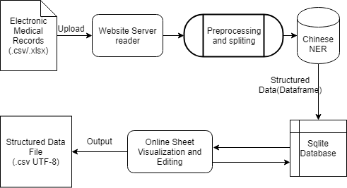
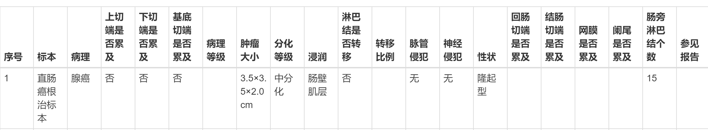

# Online Medical Diagnostic System 在线医疗诊断系统

## Introduction

​	This project is created for National Computer Designing and Programming Contest 2019  in China and wins the fisrt-class Prize for our team.It is designed to process `Raw Electronic Medical Records` of clinical cancer diagnosis into structured medical data. We also deploy a website to input data ,process on the cloud and  visualize results online. It can also support online altering the result online and outputing results into local.

​	The main procedure is shown on the flow chart above. You can also find the details and explanation of different parts in the following.

## Requirements

### Website System Requirements:

* pandas >= 0.22.0
* matplotlib >= 2.1.2
* Flask >= 0.12.2
* Flask-Booststrap >= 3.3.7.1

### EMR System Requirements:

* pandas==0.23.4
* pyltp==0.2.1
* jieba==0.39
* tensorflow==1.8.0

​     Of course you can use `python run.py` to run the codes on a  Linux/Unix System which satisfies the requirements above, But if you just want to have a glance at the project, I really recommend you to visit http://120.79.71.189:5000/records/ in case there are some techinical reasons which bring about bugs.

**Since the Server is located in China, loading page may cost a lot of time than expected. I beg your forgiveness and patience.**

## EMR Processing System

​	The system implement codes is under the folder `.\ComputerContest_BigData_EMR\`.

​	 In this system, our purpose is to transfer data from Natural Language Records into Stucture data:

> ”直肠癌根治标本”中分化腺癌，隆起型，瘤体大小3.5×3.5×2.0cm，浸润至肠壁肌层，脉管及神经未见明确癌侵犯。肠管两切端、基底切缘均未见癌累及。肠旁淋巴结15枚，未见癌转移。

:arrow_double_down:

​	We recognize the meaning of  different diagnosis segments, and rearrange them into different attributes. To achieve this, we use two general class of measures of recognization after preprocessing the data.  

​	First one is basic **regex processing**. Some part of the record is quite easy to recognize Because they have distinct features. For instance, the size of cancer is always written as forms like "3x3x2 cm", which is easy to be selected from. On the other side, some of the attributes have really limited types of values, we can get the total sets of them by consulting medical expertise.The corresponding codes is under `get_split.py`.

​	But there is still some problems we can't solve such as the sample type. There may be unlimited types of sample which we can't enumerate.  We use Chinese **NER model with Deep Learning** to recognize different semantic elements of a sentence and get the output whose comprehensive precision is over 90%. The implement code is under `\ChineseNER_master\"`Folder.

## Website Visualization Implement

​	To visualize and show our performance, I choose to build a website based on Flask which is easily accessible. I use Bootstrap elements to design the Html website and store data into database by sql. All the data visualization and edition are realized through transforming users' request into local SQL instructions.
<<<<<<< HEAD
=======

​	The main UI and interation implement codes is in `views.py` and `\template\records.html`. And the sql parts are `dbHandler.py` , `dataHandler.py`, `sql.py`. 

### Interface procedure

1. Users can upload local data file to website which will be transformed to server.
2. The server recognize the file type and encoding format and transfer into standard csv.
3. The EMR Processing System precess the data and output the results into .csv file.
4. Sql elements read the csv file and store them in sql database.
5. The Flask frame loads data from database through sql instructions and visualize data on a table.
6. Users can also insert, delete, edit records instantly on website which can be transfered into different sql instructions. After modification, the website will reload the page.

I also build a visualization function to show proportions of different types in one attributes.
>>>>>>> 0c19a5f75847ca0b353fec203f6836034c3733bd

​	The main UI and interation implement codes is in `views.py` and `\template\records.html`. And the sql parts are `dbHandler.py` , `dataHandler.py`, `sql.py`. 

### Interface procedure

1. Users can upload local data file to website which will be transformed to server.
2. The server recognize the file type and encoding format and transfer into standard csv.
3. The EMR Processing System precess the data and output the results into .csv file.
4. Sql elements read the csv file and store them in sql database.
5. The Flask frame loads data from database through sql instructions and visualize data on a table.
6. Users can also insert, delete, edit records instantly on website which can be transfered into different sql instructions. After modification, the website will reload the page.

I also build a visualization function to show proportions of different types in one attributes.
